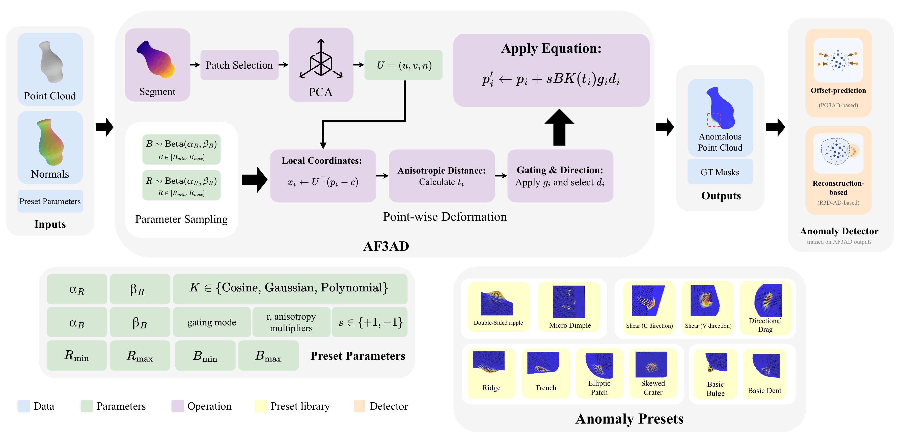
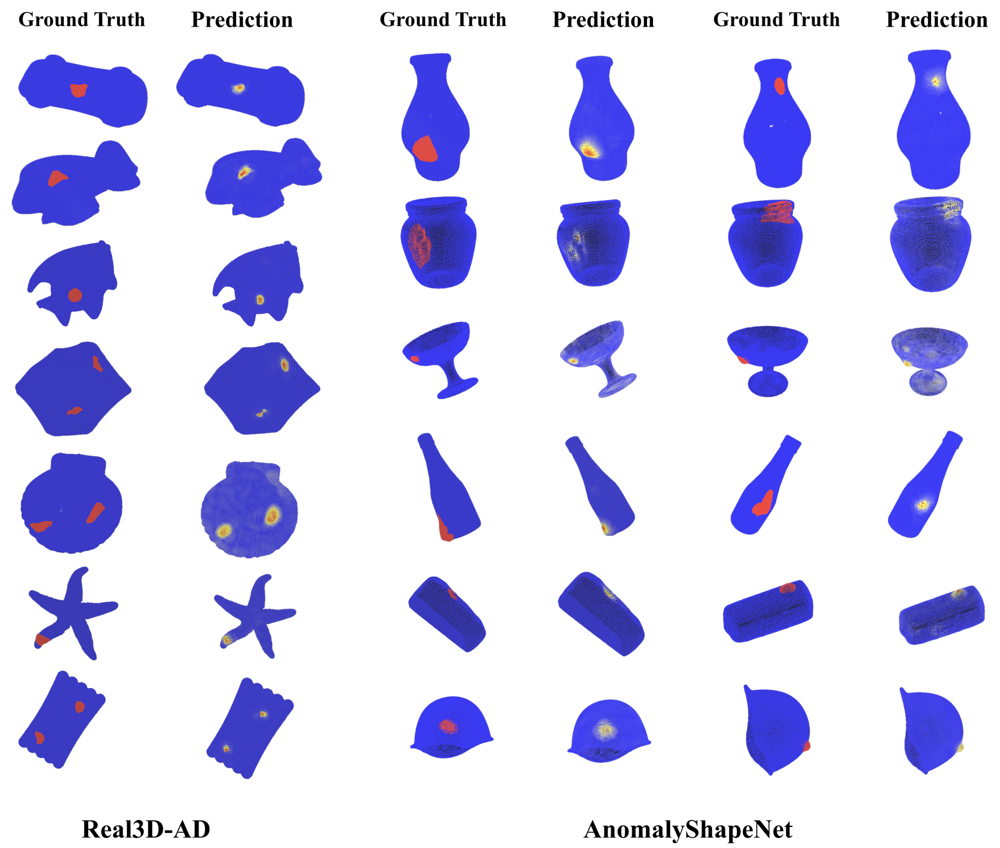

<p align="center">
  
</p>

<h1 align="center">Anomaly Factory 3D (AF3AD)</h1>

<p align="center">
  <strong>A modular factory for controlled geometric pseudo-anomalies in 3D point clouds.</strong>
</p>

<p align="center">
  <a href="https://arxiv.org/abs/2606.29181">Paper</a> |
  <a href="#basic-usage">Quickstart</a> |
  <a href="#citation">Citation</a>
</p>

AF3AD turns normal 3D point clouds into realistic pseudo-anomalous examples.
It is built for unsupervised 3D anomaly detection, where real defective training
samples are scarce but normal samples are available.

The core package is intentionally small: it takes points, normals, an anomaly
center, and a preset configuration, then returns a deformed point cloud. The
detector-specific training code is kept as reference integrations.

<p align="center">
  
</p>

<p align="center">
  <em>AF3AD selects a local region, builds a PCA frame, samples deformation
  parameters, applies anisotropic falloff and gating, then produces synthetic
  anomalies for downstream detectors.</em>
</p>

## Why AF3AD

- It is detector-independent: the synthesis core is not tied to one training
  architecture.
- It creates diverse geometric defects rather than a single generic bump.
- It supports normal and tangential deformation directions.
- It uses local PCA frames, anisotropy, kernels, and one-sided gating for
  controllable shape changes.
- It can plug into online training workflows, offline data generation, or
  custom anomaly-detection experiments.

## At A Glance

| Item | Details |
|---|---|
| Core dependency | NumPy |
| Input | Point positions, point normals, anomaly center, preset config |
| Output | Deformed point positions |
| Presets | 11 geometric pseudo-anomaly types |
| Reference integrations | PO3AD-style offset prediction and R3D-AD-style reconstruction |
| Paper benchmarks | AnomalyShapeNet and Real3D-AD |

## Preset Library

AF3AD defines 11 geometric pseudo-anomaly presets:

| # | Preset | Key characteristics |
|---|--------|---------------------|
| 0 | Basic Bulge | Isotropic outward bump (`alpha=+1`). |
| 1 | Basic Dent | Isotropic inward cavity (`alpha=-1`). |
| 2 | Ridge | Anisotropic bulge elongated along one tangent direction. |
| 3 | Trench | Anisotropic dent elongated along one tangent direction. |
| 4 | Elliptic Patch / Flat Spot | Pressed region using per-point normals. |
| 5 | Skewed Impact Crater | Oblique one-sided dent with global gating. |
| 6 | Shear U | Tangential slip along the first tangent direction. |
| 7 | Shear V | Tangential slip along the second tangent direction. |
| 8 | Double-Sided Ripple | Cosine ripple with stochastic sign. |
| 9 | Micro Dimple Field | Small dent used repeatedly for pitting-style defects. |
| 10 | Directional Drag / Stretch | Anisotropic tangential drag deformation. |

<p align="center">
  
</p>

<p align="center">
  <em>Example pseudo-anomaly outputs produced by the preset library.</em>
</p>

Each preset returns a `SmartAnomaly_Cfg` dataclass specifying support radius,
displacement magnitude, kernel, anisotropy, displacement direction, gating mode,
and random seed behavior.

## Method In One Equation

AF3AD applies localized parametric deformations to normal point clouds. Around a
selected anomaly center, it estimates a local PCA frame, transforms nearby
points into local coordinates, evaluates an anisotropic distance, applies a
falloff kernel, optionally gates the deformation to one side of the surface, and
displaces points along normal or tangential directions.

```text
p_i' = p_i + s * B * K(t_i) * g_i * d_i
```

where `s` controls bulge versus dent direction, `B` is the displacement
magnitude, `K(t_i)` is the spatial falloff kernel, `g_i` is the optional gate,
and `d_i` is the deformation direction.

Radius and magnitude are sampled from bounded Beta distributions, giving
controlled variety without extreme deformations.

## Repository Layout

```text
af3ad/                  Reusable synthesis core
integrations/po3ad/     PO3AD-style online synthesis reference integration
integrations/r3dad/     R3D-AD-style offline synthesis reference integration
scripts/                Root-level entry points
configs/                Example experiment configs
assets/                 README figures and qualitative examples
```

## Environment

The AF3AD core pseudo-anomaly synthesizer only requires NumPy.

Create a Python virtual environment named `af3ad`:

```bash
python3 -m venv ~/.venvs/af3ad
source ~/.venvs/af3ad/bin/activate

python -m pip install --upgrade pip
python -m pip install numpy
```

From the repository root, make the local package importable:

```bash
export PYTHONPATH="$PWD:$PYTHONPATH"
```

Quick check:

```bash
python -c "from af3ad import PseudoAnomalySynthesizer; print('AF3AD is ready')"
```

To leave the environment:

```bash
deactivate
```

## Basic Usage

```python
import numpy as np

from af3ad import PseudoAnomalySynthesizer

rng = np.random.default_rng(42)

points = rng.standard_normal((2048, 3)).astype(np.float32)
normals = points / (np.linalg.norm(points, axis=1, keepdims=True) + 1e-8)
center = points[rng.integers(len(points))]

synth = PseudoAnomalySynthesizer()
cfg = synth.preset_factory.presets[0]()  # Basic Bulge

deformed_points = synth.generate(points, normals, center, cfg)
print(deformed_points.shape)
```

List available presets:

```python
for idx, name in synth.list_presets():
    print(f"[{idx}] {name}")
```

Customize the radius and magnitude sampling ranges:

```python
class MyArgs:
    R_low_bound = 0.03
    R_up_bound = 0.20
    R_alpha = 2.0
    R_beta = 5.0
    B_low_bound = 0.01
    B_up_bound = 0.10
    B_alpha = 2.0
    B_beta = 5.0


synth = PseudoAnomalySynthesizer(args=MyArgs())
```

## Integration Environments

The detector integrations require their own training environments and heavier
dependencies such as PyTorch, CUDA-specific packages, MinkowskiEngine, Open3D,
FAISS, and point-cloud processing libraries.

The integration modules are not installed as separate packages. From the
repository root, make this directory importable before running the reference
launchers:

```bash
export PYTHONPATH="$PWD:$PYTHONPATH"
```

Detailed PO3AD setup notes are in
[integrations/README.md](integrations/README.md), including venv-based
installation guidance for the legacy Python 3.8/PyTorch 1.9 stack and a modern
PyTorch 2.x/CUDA 12.x checkpoint-testing stack.

For PO3AD-based training, follow the original PO3AD repository:

https://github.com/yjnanan/PO3AD

For R3D-AD-based training, follow the original R3D-AD repository:

https://github.com/zhouzheyuan/r3d-ad

This repository packages the AF3AD pseudo-anomaly synthesis core and keeps
detector-specific code as reference integrations.

## Reference Commands

After installing the appropriate detector environment, the reference launchers
can be run from the repository root:

```bash
python scripts/train_po3ad_integration.py --dataset Real3D --dataset-base-dir data/Real3D --category airplane
python scripts/train_po3ad_integration.py --dataset AnomalyShapeNet --dataset-base-dir data/AnomalyShapeNet/dataset --category ashtray0
python scripts/train_r3dad_integration.py --dataset-path ./data/dataset/pcd --category ashtray0
python scripts/generate_offline_anomalies.py integrations/r3dad/configs/shapenet-ad/base.yaml
```

## Results From The Paper

The paper evaluates AF3AD on AnomalyShapeNet and Real3D-AD. For the
offset-prediction instantiation, reported as mean +/- standard deviation over
three seeds:

| Dataset | O-AUROC | P-AUROC | Notes |
|---|---:|---:|---|
| AnomalyShapeNet | 91.5 +/- 2.1 | 92.5 +/- 1.6 | +5.5 O-AUROC over the previous best reported method. |
| Real3D-AD | 85.2 +/- 1.2 | 86.1 +/- 1.9 | +7.1 O-AUROC over the previous best reported method. |

<p align="center">
  
</p>

<p align="center">
  <em>Ground-truth anomaly regions and predicted anomaly score maps on
  Real3D-AD and AnomalyShapeNet.</em>
</p>

## Scope

AF3AD focuses on geometric surface deformations such as bulges, dents, ridges,
trenches, shear, and drag. It is not intended to synthesize purely
appearance-based anomalies, material defects, or all high-frequency crack and
scratch patterns exactly. The framework is meant to provide controllable
geometric pseudo-anomaly diversity for training anomaly detectors.

## Citation

```bibtex
@misc{balapour2026anomalyfactory3dmodular,
      title={Anomaly Factory 3D: A Modular Framework for Diverse Pseudo-Anomaly Synthesis in Unsupervised 3D Anomaly Detection},
      author={Ali Balapour and Faraz Hach},
      year={2026},
      eprint={2606.29181},
      archivePrefix={arXiv},
      primaryClass={cs.CV},
      url={https://arxiv.org/abs/2606.29181},
}
```

## Release TODO (Weighted)

- [ ] Release weights
